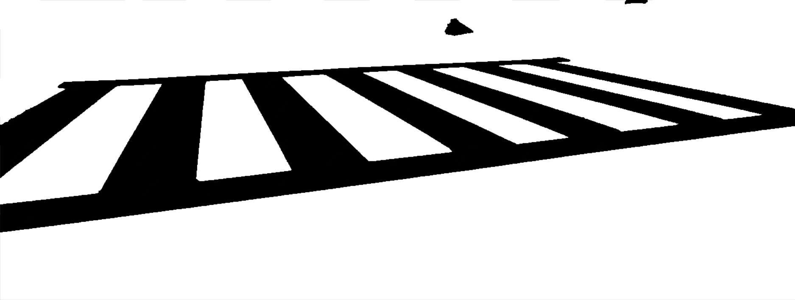
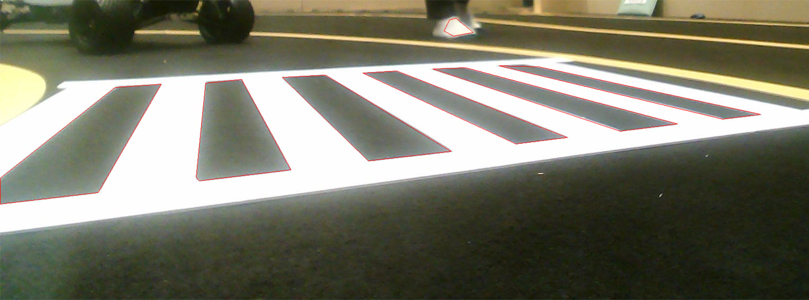
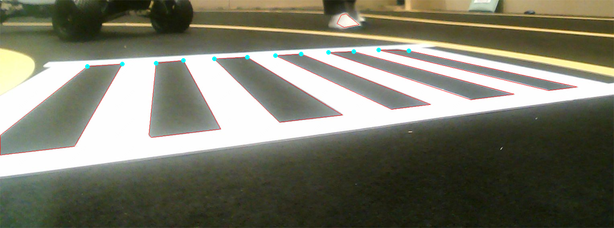
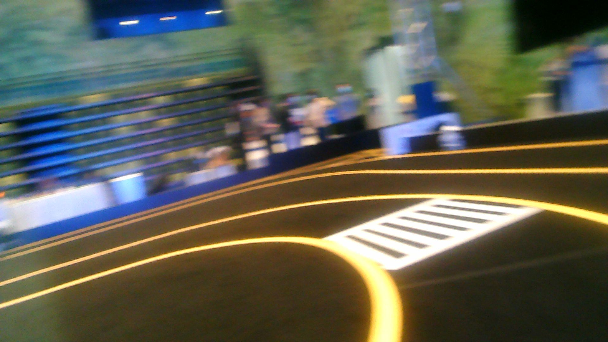
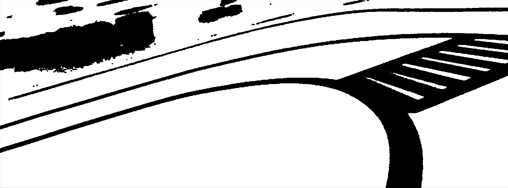
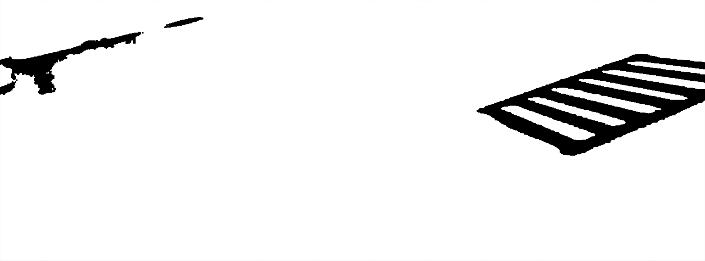

# 2021 第三届华为云人工智能大赛 · 无人车挑战杯 方案分享
## 决赛赛题
结合各队伍初赛打榜成绩（40%）、复赛打榜成绩（40%）、复赛答辩成绩（20%）综合评选出TOP20支队伍进入决赛

决赛就是要将算法落地到无人车上，全自动跑起来，**考核点:** 交通灯识别（出发&泊车）、速度控制、弯道行驶、斑马线识别、动态障碍物避障、自动泊车、竞速等


## 基本思路
+ 完整的无人车系统通常包含**感知、定位、导航、决策、控制**五个部位, 由于本人是CV方向，因此主要负责其中的视觉感知部分
+ 决赛中的视觉感知任务主要包括**交通灯**(出发&泊车)、**交通标志**(加速&减速)、**斑马线**(停车)、**车道线**(巡线行驶)
+ 考虑硬件设施,
## 交通灯&交通标志检测
`这部分其实就跟初赛/复赛差不多, 难点主要在于需要落地`
+ **数据集**: 现场采集，现场标
+ **数据增强**：同初赛/复赛
    + 既然是线下，主要策略还是多采集
+ **检测模型**：**YOLOv3-Hilens**, 由于代码需要部署到HiLens Kit(昇腾 310), 初赛/复赛的代码基本上都难以使用, 而且决赛是要实现**一整套无人车系统**, 这
部分只是任务之一, 从策略上讲, 要考虑时间成本与受益, 因此我们采纳官方的建议, 使用官方提供的YOLOv3 demo。决赛中，由于可以主动获取到实际数据, 而且也不再是
以涨点为目的，**稳定性与实时性**才是重中之重, 因此放弃堆叠初赛/复赛的一些tricks, 仅仅保留了多尺度策略

## 斑马线&车道线检测
`考虑到实时性以及稳定性等实际需要, 这部分放弃使用深度学习方法, 转而采用传统OpenCV方法, 亲测有效！`
### 斑马线识别

+ **基本策略**: 找斑马线内部**矩阵关键点**
+ 如图所示, 由于相机视角原因, 只有下半张图像能拍到赛道信息, 因此我们可以直接对原图**减半**
+ **预处理**: 减半, 卡HSV白色阈值, 二值化, 取反, 形态学操作(膨胀/腐蚀)去除噪声
```
image = image[512:, :]
hsv = cv.cvtColor(image, cv.COLOR_BGR2HSV)
mask = cv.inRange(hsv, low_bound, high_bound)
mask = cv.bitwise_not(mask)
kernel = cv.getStructuringElement(cv.MORPH_RECT, (3, 3), (-1, -1))
mask = cv.dilate(mask, kernel)
mask = cv.erode(mask, kernel)
```

+ **初筛**: 用OpenCV内置函数, 找轮廓, 拟合多边形, 因为视角下的斑马线内部通常为四边形, 少部分视角下可能会五边形, 基于此, 
可以剔除一些干扰
```
contours, hierarchy = cv.findContours(mask, cv.RETR_TREE, cv.CHAIN_APPROX_NONE)  # 找轮廓
contours_poly = []
up_corner = []
for i, contour in enumerate(contours):
    contours_poly.append(cv.approxPolyDP(contour, 5, True))  # 拟合多边形
    if len(contours_poly[i]) < 4 or len(contours_poly[i]) > 7: continue  # 筛掉奇怪边形
```

+ **复筛**: 通过斜率、尺度等标准, 筛选得出内置矩形的上角点
```
for j in range(len(contours_poly[i])):
    k = calculate_ratio(contours_poly[i][j], contours_poly[i][(j + 1) % len(contours_poly[i])])  # 算斜率找关键点
    if abs(k) > k_thres_ and get_distance(contours_poly[i][j],
                                          contours_poly[i][(j + 1) % len(contours_poly[i])]) > 10:
        if contours_poly[i][j][0][1] < contours_poly[i][(j + 1) % len(contours_poly[i])][0][1]:
            set_point(cad_point, contours_poly[i][j][0])
        else:
            set_point(cad_point, contours_poly[i][(j + 1) % len(contours_poly[i])][0])
    else:
        print('k:', k)
if len(cad_point) == 2:
    up_corner.append(cad_point[0])
    up_corner.append(cad_point[1])
    cv.circle(image, tuple(cad_point[0]), 3, (255, 255, 0), 3)
    cv.circle(image, tuple(cad_point[1]), 3, (255, 255, 0), 3)
```

+ **最后**, 根据识别出的关键点数量是否大于一定阈值来判断是否识别到斑马线

### 车道线检测

+ **基本策略**: 这部分仍然沿用经典方法**阈值法**
+ **预处理**: 同上, 减半, 卡阈值, 膨胀腐蚀. 虽然车道线是黄色的, 但在现场**灯光**影响下，
有时呈白色, 因此不能直接卡黄色阈值, 解决策略是卡亮度阈值, 但狠明显, 会误伤白色的斑马线
```
image = image[512:, :]
hsv = cv.cvtColor(image, cv.COLOR_BGR2HSV)
mask = cv.inRange(hsv, low, high)
mask = cv.bitwise_not(mask)
kernel = cv.getStructuringElement(cv.MORPH_RECT, (3, 3))
mask = cv.dilate(mask, kernel)
mask = cv.erode(mask, kernel)
```

+ **再处理**: 解决误伤的最简单办法是, 卡白色阈值识别斑马线, 然后**异或**即可

