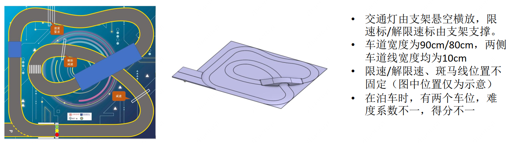
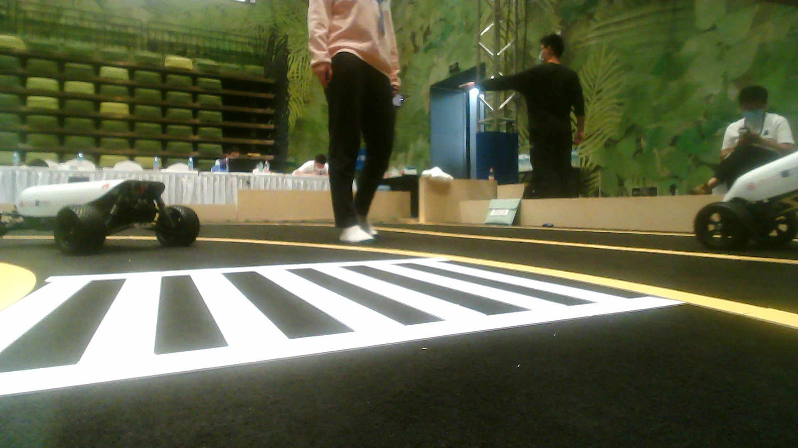

# 2021 第三届华为云人工智能大赛 · 无人车挑战杯 方案分享
## 决赛赛题
结合各队伍初赛打榜成绩（40%）、复赛打榜成绩（40%）、复赛答辩成绩（20%）综合评选出TOP20支队伍进入决赛

决赛就是要将算法落地到无人车上，全自动跑起来，**考核点:** 交通灯识别（出发&泊车）、速度控制、弯道行驶、斑马线识别、动态障碍物避障、自动泊车、竞速等

## 基本思路
+ 完整的无人车系统通常包含**感知、定位、导航、决策、控制**五个部位, 由于本人是CV方向，因此主要负责其中的视觉感知部分
+ 决赛中的视觉感知任务主要包括**交通灯**(出发&泊车)、**交通标志**(加速&减速)、**斑马线**(停车)、**车道线**(巡线行驶)
+ 考虑硬件设施,
## 交通灯&交通标志检测
`这部分其实就跟初赛/复赛差不多, 难点主要在于需要落地`
+ **数据集**: 现场采集，现场标
+ **数据增强**：同初赛/复赛
    + 既然是线下，主要策略还是多采集
+ **检测模型**：**YOLOv3-Hilens**, 由于代码需要部署到HiLens Kit(昇腾 310), 初赛/复赛的代码基本上都难以使用, 而且决赛是要实现**一整套无人车系统**, 这
部分只是任务之一, 从策略上讲, 要考虑时间成本与受益, 因此我们采纳官方的建议, 使用官方提供的YOLOv3 demo。决赛中，由于可以主动获取到实际数据, 而且也不再是
以涨点为目的，**稳定性与实时性**才是重中之重, 因此放弃堆叠初赛/复赛的一些tricks, 仅仅保留了多尺度策略

## 斑马线&车道线检测
`考虑到实时性以及稳定性等实际需要, 这部分放弃使用深度学习方法, 转而采用传统OpenCV方法, 亲测有效！`
### 斑马线识别

+ 如图所示, 由于相机视角原因, 只有下半张图像能拍到赛道信息, 因此我们可以直接对原图**减半**